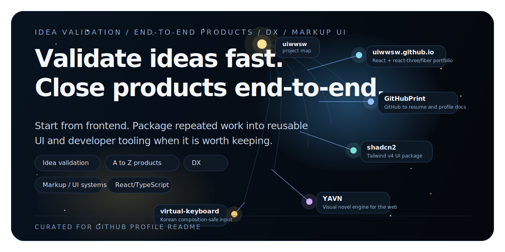

  

<strong>Refactoring myself to be a decent human.</strong>

<strong>Frontend engineer who validates ideas fast, closes products end-to-end, and turns repeated work into UI/DX assets.</strong>

  I start from frontend, but I do not stop at the screen. I test ideas with small products, build some services end-to-end when needed, and package repeated work as reusable UI and developer tooling. 
  저는 프론트엔드에서 시작하지만 화면 구현에서 멈추지 않습니다. 좋은 아이디어는 빠르게 제품으로 검증하고, 필요하면 백엔드까지 붙여 A to Z로 닫고, 반복되는 문제는 UI나 DX 자산으로 다시 정리합니다.

  4 ways I work · 4 npm packages · 5 latest posts synced from Velog

  
  
  
  
  
  

## How I Work

### 1. 아이디어 검증

좋은 아이디어가 생기면 오래 설명하지 않고, 먼저 작게 만들어서 실제 반응을 확인합니다.

- [GitHubPrint](https://githubprint.vercel.app) — GitHub를 개발자 문서와 이력서형 결과로 바꾸는 서비스.
- [BackThen](https://backthen.vercel.app) — 그해의 오늘을 바로 보여주는 실험형 서비스.
- [virtual-keyboard](https://www.npmjs.com/package/@uiwwsw/virtual-keyboard) — 한글 composition 이슈를 해결하기 위해 만든 입력 라이브러리.
- [koreanscript](https://github.com/uiwwsw/koreanscript) — 한글 키워드로 TypeScript를 쓰는 초간단 트랜스파일러.

### 2. A to Z 제품 개발

서비스를 끝까지 닫아야 할 때는 프론트엔드에 머물지 않고, 필요한 만큼 백엔드와 운영 흐름까지 직접 만듭니다.

- **찐리뷰** — 디플리케이트된 리뷰 플랫폼 웹서비스. PostgreSQL, Next.js, Prisma 기반.
- **머랭트립** ([App Store](https://apps.apple.com/kr/app/%EB%A8%B8%EB%9E%AD%ED%8A%B8%EB%A6%BD/id6751193690) · [Google Play](https://play.google.com/store/apps/details?id=io.brewstar.meringuetrip)) — 반경 검색으로 완성하는 똑똑한 여행 설계.
- **미유미유** ([App Store](https://apps.apple.com/kr/app/%EB%AF%B8%EC%9C%A0%EB%AF%B8%EC%9C%A0/id6756718662)) — 커플을 위한 햅틱 연결 앱.
- **큐알토큰** — 수기 선불권을 가장 똑똑하게. 작업 중인 서비스.

### 3. DX / Tooling

반복 작업을 줄이고 개발 속도를 올리기 위한 도구나 라이브러리를 자주 만듭니다.

- [@uiwwsw/react-query-helper](https://www.npmjs.com/package/@uiwwsw/react-query-helper) — TypeScript API 함수에서 React Query 코드를 자동 생성하는 CLI.
- [@uiwwsw/infinite-paper](https://www.npmjs.com/package/@uiwwsw/infinite-paper) — infinite scroll + pagination 데이터 윈도우 관리 라이브러리.
- [@uiwwsw/easter-egg](https://www.npmjs.com/package/@uiwwsw/easter-egg) — 작은 인터랙션을 빠르게 붙일 수 있게 만든 유틸리티.
- [@uiwwsw/virtual-keyboard](https://www.npmjs.com/package/@uiwwsw/virtual-keyboard) — 입력 경험을 통제하기 위한 브라우저 문제 해결형 라이브러리.

### 4. 마크업 / UI 시스템

마크업과 화면 완성도, 그리고 재사용 가능한 UI 구조를 오래 다뤄 왔습니다.

- [shadcn2](https://shadcn2.vercel.app) — Tailwind CSS v4 기반 UI 패키지와 Storybook 운영.
- [heybit-ui-styled-components](https://www.npmjs.com/package/heybit-ui-styled-components) — styled-components 기반 디자인 시스템 패키지.
- [주니어 시절 포트폴리오](https://uiwwnw.github.io/portfolio) — 초기 마크업 중심 포트폴리오.

## Frontend Signals

- **React / TypeScript 중심 서비스 개발**: 서비스형 웹 제품과 라이브러리를 React/TypeScript 중심으로 꾸준히 만들었습니다.
- **브라우저 문제 해결과 UI 품질**: 한글 입력 composition 같은 브라우저 edge case를 직접 푸는 타입입니다.
- **재사용 가능한 UI와 DX 자산화**: 한 번 만든 것을 라이브러리, 패키지, 워크플로로 다시 남기는 편입니다.
- **필요할 때는 A to Z로 닫는 실행력**: 프론트엔드에서 시작하지만, 제품을 완성하려면 백엔드와 배포까지 직접 붙입니다.

<b>Open-source package index</b> (4)

### [@uiwwsw/react-query-helper](https://www.npmjs.com/package/@uiwwsw/react-query-helper)
   

React Query Helper is a CLI tool that automatically generates React Query hooks and option objects from TypeScript API functions.

### [@uiwwsw/virtual-keyboard](https://www.npmjs.com/package/@uiwwsw/virtual-keyboard)
   

A revolutionary virtual keyboard solution for React that solves the Korean composition issue.

### [@uiwwsw/infinite-paper](https://www.npmjs.com/package/@uiwwsw/infinite-paper)
   

Composable infinite scroll + pagination data window manager with virtualized lists.

### [@uiwwsw/easter-egg](https://www.npmjs.com/package/@uiwwsw/easter-egg)
   

Description not provided.

## Writing

> Code is logical, but people are emotional. I write about both.

<!--START_VELOG-->
- [전달 가능한 개발자 문서(깃허브 프린트)](https://velog.io/@uiwwsw/GitHub를-전달-가능한-개발자-문서로-바꾸는-GitFolio를-만들었습니다) _( 2026. 03. 18. )_
- [[Retrospective] 머랭트립 리팩토링: 기능 추가보다 '완성도'에 집착하기 (Flutter 전환기)](https://velog.io/@uiwwsw/Retrospective-머랭트립-리팩토링-기능-추가보다-완성도에-집착하기-Flutter-전환기) _( 2026. 01. 22. )_
- [다중 장소 검색 서비스 머랭트립 개발기](https://velog.io/@uiwwsw/지도-앱-켰다가-뇌-터질-뻔해서-직접-만들었습니다-feat.-UI만-5번-엎은-썰) _( 2025. 12. 09. )_
- [🚀 스토리북에 버전별 컴포넌트 모으기 — 한 곳에서 깔끔하게 비교하는 법](https://velog.io/@uiwwsw/스토리북에-버전별-컴포넌트-보여주기-낭비-없이-한-곳에-모으는-법) _( 2025. 10. 16. )_
- [🔐 재미와 보안, 두 마리 토끼를 잡는 이스터에그 구현법](https://velog.io/@uiwwsw/재미와-보안-두-마리-토끼를-잡는-이스터에그-구현법) _( 2025. 07. 21. )_
<!--END_VELOG-->

---

**Last profile refresh:** 2026. 03. 25.  
_Updated automatically via GitHub Actions_
