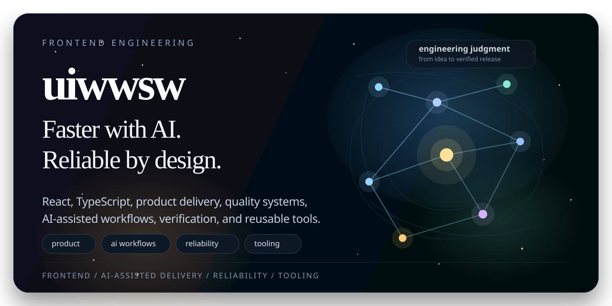

  

<strong>Useful interfaces. Reliable delivery.</strong>

<strong>React / TypeScript frontend work focused on product delivery, UI quality, and reusable engineering systems.</strong>

  Work spans idea validation, production UI, release support, browser edge cases, and DX automation that reduces repeated effort. The focus is maintainable implementation that stays close to product context. 
  React와 TypeScript를 중심으로 제품 UI를 구현합니다. 아이디어 검증, 실제 서비스 UI, 출시 지원, 브라우저 edge case, 반복 작업을 줄이는 DX 자동화까지 연결해 유지보수 가능한 결과물의 완성도를 높입니다.

  4 frontend lanes · 4 public npm packages · 5 latest technical posts

  
  
  
  
  
  

## Start Here

| Focus | Link | Why |
| --- | --- | --- |
| Product Delivery | [GitHubPrint](https://githubprint.vercel.app) | GitHub 활동을 전달 가능한 개발자 문서로 바꾸는 서비스를 직접 만들고 배포했습니다. |
| App Launch | [머랭트립](https://apps.apple.com/kr/app/%EB%A8%B8%EB%9E%AD%ED%8A%B8%EB%A6%BD/id6751193690) | 기획, 구현, 스토어 출시 흐름까지 경험한 여행 설계 앱입니다. |
| DX Automation | [@uiwwsw/react-query-helper](https://www.npmjs.com/package/@uiwwsw/react-query-helper) | 반복되는 React Query 훅 작성을 자동화하는 CLI 패키지입니다. |
| Input Quality | [@uiwwsw/virtual-keyboard](https://www.npmjs.com/package/@uiwwsw/virtual-keyboard) | 한글 IME composition 문제를 입력 UX 품질 관점에서 해결합니다. |

## How I Work

### 1. Product Validation

아이디어를 문서에만 두지 않고, 작게 만들고 배포해 실제 사용 맥락에서 빠르게 확인합니다.

- [GitHubPrint](https://githubprint.vercel.app) — GitHub를 개발자 문서와 이력서형 결과로 바꾸는 서비스.
- [BackThen](https://backthen.vercel.app) — 그해의 오늘을 바로 보여주는 실험형 서비스.
- **make-wire** ([재현영상](https://www.youtube.com/watch?v=Wp9AG1U_qmI)) — 피그마 기획서를 다국어 JSON으로 출력해, 휘발되던 기획 문서를 개발 코드와 연결하고 다국어 운영 비용을 줄일 수 있는지 빠르게 검증한 프로토타입.
- [virtual-keyboard](https://www.npmjs.com/package/@uiwwsw/virtual-keyboard) — 한글 composition 이슈를 해결하기 위해 만든 입력 라이브러리.
- [koreanscript](https://github.com/uiwwsw/koreanscript) — 한글 키워드로 TypeScript를 쓰는 초간단 트랜스파일러.

### 2. Product Delivery

프론트엔드 구현을 중심으로 필요한 백엔드 연동, 배포, 스토어 출시, 운영 흐름까지 제품 완성에 필요한 범위를 챙깁니다.

- **찐리뷰** — 디플리케이트된 리뷰 플랫폼 웹서비스. PostgreSQL, Next.js, Prisma 기반.
- **머랭트립** ([App Store](https://apps.apple.com/kr/app/%EB%A8%B8%EB%9E%AD%ED%8A%B8%EB%A6%BD/id6751193690) · [Google Play](https://play.google.com/store/apps/details?id=io.brewstar.meringuetrip)) — 반경 검색으로 완성하는 똑똑한 여행 설계.
- **미유미유** ([App Store](https://apps.apple.com/kr/app/%EB%AF%B8%EC%9C%A0%EB%AF%B8%EC%9C%A0/id6756718662)) — 커플을 위한 햅틱 연결 앱.
- **큐알토큰** — 수기 선불권을 가장 똑똑하게. 작업 중인 서비스.

### 3. DX Automation

반복 작업을 줄이고 개발 속도를 높이기 위한 도구, 라이브러리, 워크플로를 자산으로 남깁니다.

- [@uiwwsw/react-query-helper](https://www.npmjs.com/package/@uiwwsw/react-query-helper) — TypeScript API 함수에서 React Query 코드를 자동 생성하는 CLI.
- [@uiwwsw/infinite-paper](https://www.npmjs.com/package/@uiwwsw/infinite-paper) — infinite scroll + pagination 데이터 윈도우 관리 라이브러리.
- [@uiwwsw/easter-egg](https://www.npmjs.com/package/@uiwwsw/easter-egg) — 작은 인터랙션을 빠르게 붙일 수 있게 만든 유틸리티.
- [@uiwwsw/virtual-keyboard](https://www.npmjs.com/package/@uiwwsw/virtual-keyboard) — 입력 경험을 통제하기 위한 브라우저 문제 해결형 라이브러리.

### 4. UI Engineering

마크업, 화면 완성도, 접근 가능한 UI 구조, 재사용 가능한 디자인 시스템을 제품 품질의 기반으로 다룹니다.

- [shadcn2](https://shadcn2.vercel.app) — Tailwind CSS v4 기반 UI 패키지와 Storybook 운영.
- [heybit-ui-styled-components](https://www.npmjs.com/package/heybit-ui-styled-components) — styled-components 기반 디자인 시스템 패키지.
- [초기 마크업 포트폴리오](https://uiwwnw.github.io/portfolio) — 마크업 중심 작업의 출발점을 담은 초기 포트폴리오.

## Frontend Signals

- **React / TypeScript Execution**: 서비스형 웹 제품과 오픈소스 패키지를 React / TypeScript 중심으로 만들고 개선합니다.
- **Product Delivery Range**: 화면 구현을 넘어 API 연동, 배포, 출시 지원, 사용자 반응 확인까지 제품 전달 과정에 참여합니다.
- **Maintainable UI Quality**: 마크업 구조, 상태 흐름, 브라우저 edge case, 입력 UX까지 유지보수 가능한 화면 품질로 연결합니다.
- **Reusable Engineering Assets**: 반복되는 문제를 라이브러리, 자동화 CLI, UI 시스템, 문서화된 워크플로로 정리합니다.

<b>Open-source package index</b> (4)

### [@uiwwsw/react-query-helper](https://www.npmjs.com/package/@uiwwsw/react-query-helper)
   

React Query Helper is a CLI tool that automatically generates React Query hooks and option objects from TypeScript API functions.

### [@uiwwsw/virtual-keyboard](https://www.npmjs.com/package/@uiwwsw/virtual-keyboard)
   

A React virtual keyboard package for controlled Korean input without IME composition edge cases.

### [@uiwwsw/infinite-paper](https://www.npmjs.com/package/@uiwwsw/infinite-paper)
   

Composable infinite scroll + pagination data window manager with virtualized lists.

### [@uiwwsw/easter-egg](https://www.npmjs.com/package/@uiwwsw/easter-egg)
   

Add playful hidden interactions to React apps with small, reusable trigger utilities.

## Writing

> Code is logical, but people are emotional. I write about both.

<!--START_VELOG-->
- [실 서비스 코드를 건드리지 않고 테스트하기: API 인터셉터 기반 목 데이터 설계](https://velog.io/@uiwwsw/실-서비스-코드를-건드리지-않고-테스트하기-API-인터셉터-기반-목-데이터-설계) _( 2026. 05. 22. )_
- [바이브코딩의 끝에는 누가 서 있어야 하는가](https://velog.io/@uiwwsw/바이브코딩의-끝에는-누가-서-있어야-하는가) _( 2026. 05. 13. )_
- [LinkedIn 실험 일지 1 — 시작](https://velog.io/@uiwwsw/LinkedIn-실험-일지-1-시작) _( 2026. 04. 04. )_
- [전달 가능한 개발자 문서(깃허브 프린트)](https://velog.io/@uiwwsw/GitHub를-전달-가능한-개발자-문서로-바꾸는-GitFolio를-만들었습니다) _( 2026. 03. 18. )_
- [[Retrospective] 머랭트립 리팩토링: 기능 추가보다 '완성도'에 집착하기 (Flutter 전환기)](https://velog.io/@uiwwsw/Retrospective-머랭트립-리팩토링-기능-추가보다-완성도에-집착하기-Flutter-전환기) _( 2026. 01. 23. )_
<!--END_VELOG-->

---

**Last profile refresh:** 2026. 07. 31. 
_Updated automatically via GitHub Actions_
