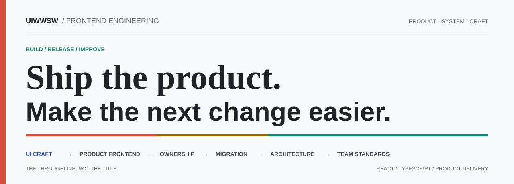

<picture>
  <source media="(prefers-color-scheme: dark) and (max-width: 600px)" srcset="./assets/profile-dark-mobile.svg">
  <source media="(prefers-color-scheme: light) and (max-width: 600px)" srcset="./assets/profile-light-mobile.svg">
  <source media="(prefers-color-scheme: dark)" srcset="./assets/profile-dark.svg">
  <source media="(prefers-color-scheme: light)" srcset="./assets/profile-light.svg">
  
</picture>

  <strong>제품을 출시하고, 다음 변경이 쉬워지는 구조를 남깁니다.</strong> 
  UI에서 시작해 제품 구축, 운영, 마이그레이션, 아키텍처와 팀 표준까지 이어 왔습니다.

  <samp><a href="mailto:uiwwsw@icloud.com">EMAIL</a> &nbsp;·&nbsp; <a href="https://www.linkedin.com/in/uiwwsw/">LINKEDIN</a> &nbsp;·&nbsp; <a href="https://velog.io/@uiwwsw">TECH LOG</a> &nbsp;·&nbsp; <a href="https://uiwwsw.github.io/">WRITING UNIVERSE</a> &nbsp;·&nbsp; <a href="https://brewstar-code.github.io/">PRODUCTS</a> &nbsp;·&nbsp; <a href="https://githubprint.vercel.app/showcase">RESUME</a></samp>

## Selected Work

### [GitHubPrint](https://githubprint.vercel.app)
LIVE PRODUCT · <a href="https://github.com/uiwwsw/githubprint">source</a>

Public GitHub evidence into a shareable developer document, with validated AI output, deterministic fallback, and PDF/Word export.

### [test-mode](https://github.com/uiwwsw/test-mode)
OPEN-SOURCE TOOL

Named API scenarios make loading, failure, and edge states reproducible across browser and server boundaries.

### [virtual-keyboard](https://www.npmjs.com/package/@uiwwsw/virtual-keyboard)
NPM PACKAGE · <a href="https://github.com/uiwwsw/virtual-keyboard">source</a>

A controlled React keyboard that owns Hangul composition instead of patching native IME symptoms.

### [react-query-helper](https://www.npmjs.com/package/@uiwwsw/react-query-helper)
NPM PACKAGE · <a href="https://github.com/uiwwsw/react-query-helper">source</a>

A TypeScript CLI that turns API functions into consistent query, mutation, and infinite-query options.

## Independent Products

[Brewstar Code](https://brewstar-code.github.io/)에서 직접 출시하고 운영하는 제품들입니다.

<!--START_PRODUCTS-->
- **[머랭트립 / MeringTrip](https://brewstar-code.github.io/meringuetrip/)** — 반경 검색 기반 여행 설계 
  `Flutter` · [Google Play](https://play.google.com/store/apps/details?id=io.brewstar.meringuetrip) · [App Store](https://apps.apple.com/kr/app/%EB%A8%B8%EB%9E%AD%ED%8A%B8%EB%A6%BD/id6751193690)
- **[미유미유 / MeyouMeyou](https://brewstar-code.github.io/meyoumeyou/)** — 커플을 위한 햅틱 연결 
  `Flutter` · [App Store](https://apps.apple.com/kr/app/%EB%AF%B8%EC%9C%A0%EB%AF%B8%EC%9C%A0/id6756718662)
<!--END_PRODUCTS-->

## Writing

결과뿐 아니라 선택의 이유와 구현의 맥락을 씁니다.

<!--START_VELOG-->
- [실 서비스 코드를 건드리지 않고 테스트하기: API 인터셉터 기반 목 데이터 설계](https://velog.io/@uiwwsw/실-서비스-코드를-건드리지-않고-테스트하기-API-인터셉터-기반-목-데이터-설계) 2026. 05. 22.
- [바이브코딩의 끝에는 누가 서 있어야 하는가](https://velog.io/@uiwwsw/바이브코딩의-끝에는-누가-서-있어야-하는가) 2026. 05. 13.
- [전달 가능한 개발자 문서(깃허브 프린트)](https://velog.io/@uiwwsw/GitHub를-전달-가능한-개발자-문서로-바꾸는-GitFolio를-만들었습니다) 2026. 03. 18.
<!--END_VELOG-->

[모든 기술 글](https://velog.io/@uiwwsw) · [글의 우주](https://uiwwsw.github.io/)
